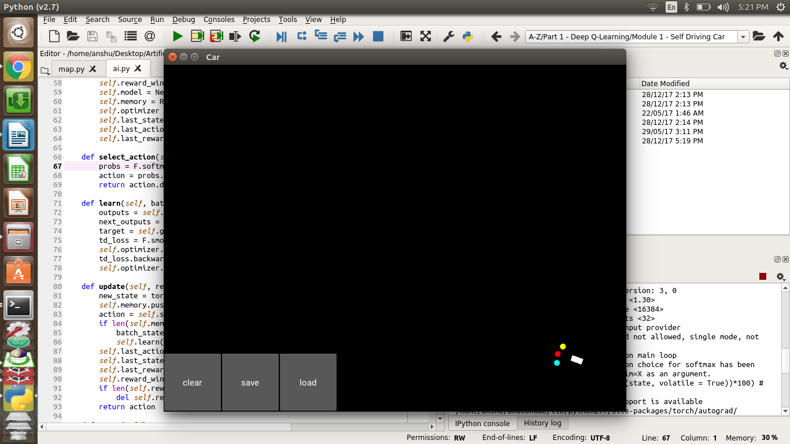
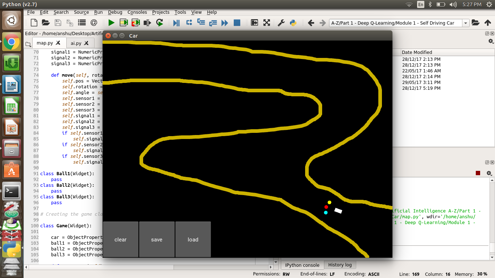
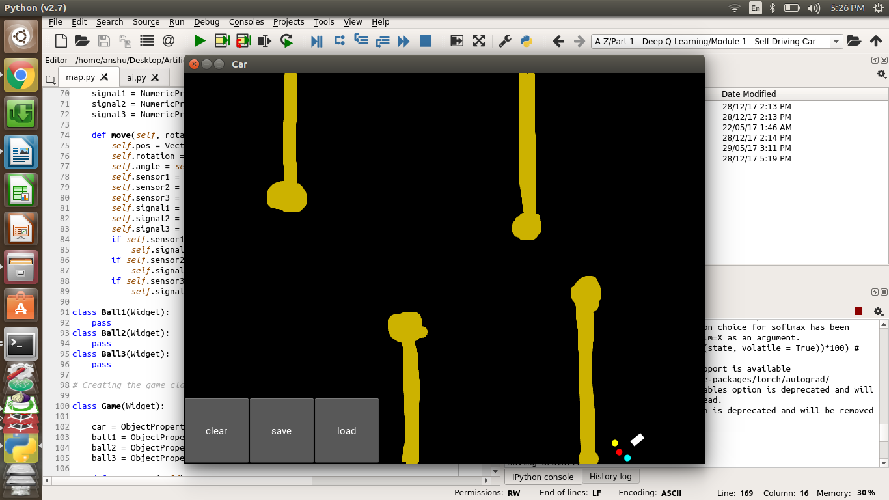

<!DOCTYPE HTML PUBLIC "-//W3C//DTD HTML 4.0 Transitional//EN">
<html>
<head>
	<meta http-equiv="content-type" content="text/html; charset=utf-8"/>
	<title></title>
	<meta name="generator" content="LibreOffice 5.3.1.2 (Linux)"/>
	<meta name="created" content="00:00:00"/>
	<meta name="changed" content="2017-12-28T17:30:19.527310294"/>
	
</head>
<body lang="en-IN" dir="ltr">
<h1>Self Driving car 
</h1>
<h3 class="western">Introduction</h3>

This project is related to building an agent to drive a car. The
agent learns to drive the car by getting the rewards after geeting in
various states in the enviornment. Basicially this this reinforcement
or q-learning. I basically have created a artififcal neural network
in which we have on input state then a hidden layer in which
rectifier function is used for activation of the neuron. Then the
output of the hidden layer are fed to softmax function to take the
right action. 

<h3 class="western">Setting up the project</h3>

Use the following code to clone the repository <code class="western">git
clone https://github.com/kumaranshu72/self-driving-car.git
self_driving_car </code> 
Install the Anaconda Distribution of
Python from <a href="https://anaconda.org/anaconda/python">here</a>
 
Install The following python libraries 
pyTourch : <code class="western">conda
install pytorch torchvision -c pytorch</code> 
kivy :
https://kivy.org 

<h3 class="western">Running the Project</h3>
<ol>
	<li/>

Open Terminal 
	

	<li/>

Type <code class="western">anaconda-navigator</code>
	and run spider. 
	

	<li/>

Using file explorer in spider go
	to the project directory and restart the kernal. 
	

	<li/>

open <b>map.py</b> 
	

	<li/>

Execute map.py.

	

	

	

	

		

</ol>

 
 

 
 

 
 

 
 

 
 

 
 

 
 

 
 

 
 

                                                              
Level 1

 
 

 
 

                                                                  
           level 2

 
 

 
 

                                                               
(level 3)

</body>
</html>